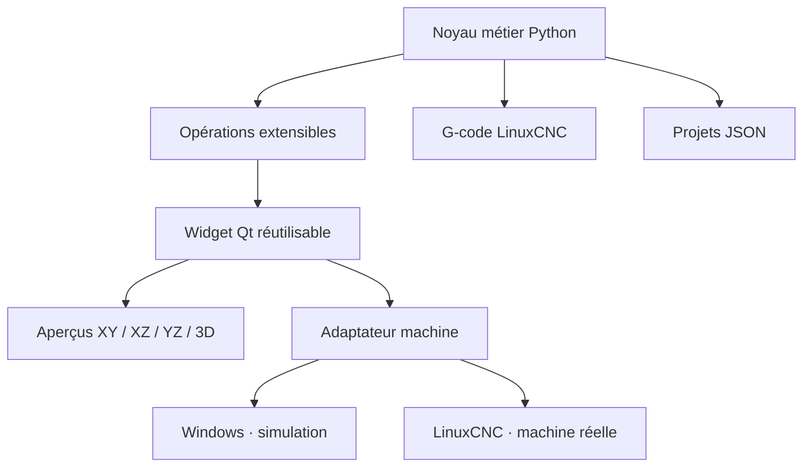

# OpenMill

Atelier conversationnel de fraisage CNC, pensé pour être développé sous **Windows**, utilisé avec **LinuxCNC**, puis intégré proprement dans **Probe Basic / QtPyVCP**.

**Version 0.4.5 — synchronisation avec le véritable éditeur G-code de `MAIN`.**

L’objectif n’est pas de créer un fork difficile à maintenir : le moteur d’usinage, les opérations, les aperçus et la connexion machine sont séparés. Le même `QWidget` peut fonctionner comme application autonome ou devenir un onglet d’une interface LinuxCNC.

> Version alpha. Ne jamais envoyer un programme sur une machine réelle sans simulation, contrôle des origines, des outils, des profondeurs, des déplacements rapides et du bridage.

## Ce qui fonctionne déjà

- Surfaçage en zigzag avec recouvrement et dépassement de l’outil.
- Poche rectangulaire avec angles rayonnés et compensation du diamètre.
- Poche circulaire par contours concentriques.
- Hexagone intérieur ou extérieur avec cote sur plats et orientation.
- Réseau circulaire de perçages, cercle complet ou secteur angulaire.
- Réseau rectangulaire de perçages, orientable et parcouru en zigzag.
- Perçage avec débourrage optionnel.
- Brut rectangulaire configurable, origine au coin ou au centre.
- Aperçus interactifs dessus `XY`, face `XZ`, côté `YZ`.
- Aperçu 3D VTK avec brut translucide et rendu compatible sans OpenGL si le pilote graphique est capricieux.
- Lecture animée de la trajectoire, curseur de progression, vitesse, passes Z et coloration type slicer.
- Galerie tactile d’opérations illustrées, classées par famille et recherchables.
- Réglages tactiles +/−, valeurs ajustables par glissement, faders et sélecteurs d’angle circulaires.
- Paramètres et trajectoires mis à jour immédiatement.
- Projets multi-opérations, réorganisation, désactivation et duplication.
- Export de programmes `.ngc` et sauvegarde JSON versionnée.
- Interface intégralement en français, bibliothèque d’outils simulée et adaptateur LinuxCNC séparé.
- Onglet Probe Basic automatique avec `USER_TABS_PATH`, sans fork ni modification upstream.
- Compatibilité avec les environnements Probe Basic PyQt5 et PySide6.
- Chargement sécurisé du G-code dans Probe Basic / LinuxCNC, sans départ cycle automatique.
- G-code ASCII strict pour les éditeurs Probe Basic historiques, avec fins de ligne Linux.
- Bascule automatique vers `MAIN` après chargement depuis OpenMill.
- Aperçu OpenMill animé directement dans `MAIN`, en alternative au BackPlot Probe Basic.
- Sélection d’une ligne G-code synchronisée avec la progression de l’aperçu OpenMill.
- Navigation tactile ligne précédente/suivante depuis la barre de l’aperçu.
- Ligne G-code courante surlignée et maintenue visible par la navigation de l’aperçu.
- Surbrillance G-code sombre et contrastée, compatible avec les couleurs de syntaxe Probe Basic.
- Marqueur de ligne OpenMill explicite, conservé après chaque rechargement du document G-code.
- Synchronisation G-code/aperçu temporisée pour éviter les reconstructions VTK en rafale.
- Un seul moteur d’aperçu calculé à la fois et sortie de diagnostic QtPyVCP parasite neutralisée.
- Bouton flottant **OpenMill** toujours accessible sur le BackPlot VTK natif.
- BackPlot VTK natif conservé à sa position d’origine et affiché en alternance avec OpenMill.
- Import visuel des programmes externes : G0/G1/G2/G3, arcs IJK/R, G17/G18/G19, G20/G21 et G90/G91.
- Outils lus depuis le véritable fichier `TOOL_TABLE` de la configuration LinuxCNC, sans entrées runtime fantômes.
- Diagnostic d’installation et parcours d’intégration simulé utilisables sous Windows.
- Thème global Probe Basic moderne et réversible, sans remplacer sa police condensée ni casser ses dimensions fixes.
- Mode intégré compact avec programme G-code repliable pour conserver la hauteur de l’aperçu.
- Extensions d’opérations installables indépendamment via les entry points Python.
- Tests métier sans Qt, VTK ni LinuxCNC ; CI GitHub Windows et Linux.

## Démarrage rapide sous Windows

1. Installer Python 3.11 ou une version plus récente depuis [python.org](https://www.python.org/downloads/windows/).
2. Décompresser le projet.
3. Double-cliquer sur `lancer_windows.bat`.

Au premier lancement, le script crée un environnement virtuel et installe PyQt5 ainsi que VTK. Le téléchargement de VTK peut prendre quelques minutes. L’application s’ouvre ensuite directement sur une pièce de démonstration.

Alternative depuis PowerShell :

```powershell
py -m venv .venv
.\.venv\Scripts\python.exe -m pip install -e ".[gui]"
.\.venv\Scripts\python.exe -m openmill
```

Pour ouvrir l’exemple fourni :

```powershell
.\.venv\Scripts\python.exe -m openmill examples\plaque_demo.openmill.json
```

## Démarrage sous Linux

```bash
python3 -m venv .venv
source .venv/bin/activate
python -m pip install -e ".[gui]"
openmill
```

Sur une installation LinuxCNC utilisant déjà les paquets système PyQt5/VTK, privilégier un environnement cohérent avec ces dépendances :

```bash
python3 -m venv --system-site-packages .venv
source .venv/bin/activate
python -m pip install -e .
```

Le lanceur autonome utilise volontairement une machine simulée. Le widget d’intégration utilise l’adaptateur LinuxCNC réel ; voir [docs/integration-probe-basic.md](docs/integration-probe-basic.md).

## Tester l’intégration Probe Basic dès maintenant

Sous Windows, après le premier lancement :

```powershell
.\.venv\Scripts\python.exe -m openmill.integration.check --smoke-test
```

Sous Linux, après installation du paquet :

```bash
openmill-probe-check --json --smoke-test
```

Le test construit une pièce, génère son G-code et la charge dans un Probe Basic simulé. Aucun LinuxCNC, Qt ou VTK n’est nécessaire.

Pour l’intégration réelle, copier `examples/probe_basic/user_tabs/openmill/` dans le dossier `user_tabs/` de la configuration machine et déclarer :

```ini
[DISPLAY]
USER_TABS_PATH = user_tabs/
```

Probe Basic ajoute alors un onglet **CONVERSATIONNEL** avec un bouton **Charger dans Probe Basic**. Procédure complète, sécurité et solution alternative : [docs/integration-probe-basic.md](docs/integration-probe-basic.md).

Le bouton **Thème PB · moderne/original** permet de comparer instantanément le thème unifié et l’apparence native. Pour démarrer durablement avec le thème original :

```bash
export OPENMILL_THEME=original
```

## Architecture



```text
src/openmill/
├── adapters/      interface machine, simulation, LinuxCNC
├── core/          modèles, géométrie, registre, moteur, G-code, projets
├── operations/    surfaçage, poches, hexagones, réseaux de perçage
├── ui/            formulaire, aperçu vectoriel, VTK, atelier Qt
└── integration/   onglet Probe Basic, pont machine sécurisé, diagnostic
```

Détails : [docs/architecture.md](docs/architecture.md).

## Ajouter une opération

Une opération définit uniquement ses paramètres et ses déplacements. Le formulaire, les vues, la persistance JSON et l’export G-code la prennent automatiquement en charge.

```python
from openmill.core.models import OperationRecord, Stock, Tool, Toolpath
from openmill.core.registry import FieldSpec, OperationPlugin, registry


@registry.register
class Rainure(OperationPlugin):
    id = "rainure"
    label = "Rainure droite"
    category = "Profils"
    description = "Rainure paramétrable."
    fields = (
        FieldSpec("center_x", "Centre X", 0),
        FieldSpec("center_y", "Centre Y", 0),
        FieldSpec("length", "Longueur", 40, minimum=1),
    )

    @classmethod
    def generate(cls, operation: OperationRecord, stock: Stock, tool: Tool) -> Toolpath:
        parameters = operation.parameters
        builder = cls.builder(operation, tool)
        builder.rapid(parameters["center_x"] - parameters["length"] / 2, parameters["center_y"])
        builder.plunge(parameters["z_final"])
        builder.cut(parameters["center_x"] + parameters["length"] / 2, parameters["center_y"])
        builder.retract()
        return builder.result
```

Une extension distribuée séparément expose sa classe ainsi :

```toml
[project.entry-points."openmill.operations"]
rainure = "mon_extension.operations:Rainure"
```

## Tests

Après une installation du projet :

```bash
python -m unittest discover -s tests -v
```

Sans installation, sous Linux/macOS :

```bash
PYTHONPATH=src python -m unittest discover -s tests -v
```

Sous PowerShell :

```powershell
$env:PYTHONPATH = "src"
python -m unittest discover -s tests -v
```

## Stratégie GitHub recommandée

Créer un dépôt indépendant, par exemple `openmill-conversational`, avec une branche principale protégée, des pull requests courtes et une CI systématique. L’intégration Probe Basic doit rester un adaptateur et un widget dédiés, pas une copie de son code source.

Lorsque l’atelier est stabilisé :

1. publier le paquet et documenter son installation externe ;
2. tester le widget sur une configuration Probe Basic simulée ;
3. proposer une intégration optionnelle et peu intrusive au projet upstream ;
4. déplacer éventuellement les composants retenus upstream, après discussion avec ses mainteneurs.

Voir [CONTRIBUTING.md](CONTRIBUTING.md) et [docs/roadmap.md](docs/roadmap.md).

## Limites actuelles

- L’aperçu affiche les volumes parcourus ; il ne soustrait pas encore réellement la matière du brut.
- Les collisions avec brides, porte-outil et machine ne sont pas simulées.
- La trajectoire utilise actuellement des segments `G1`, pas d’arcs `G2/G3` ni de cycles LinuxCNC dédiés.
- Le pont Probe Basic est testé en simulation ; son interface graphique doit encore être validée sur une installation LinuxCNC effective.
- Les stratégies d’entrée hélicoïdale, rampes, finition, bridage et postprocesseurs enrichis restent à développer.

## Licence

Le code de ce dépôt est sous licence MIT. Les dépendances conservent leurs propres conditions, notamment PyQt5 ; vérifier leurs licences avant toute redistribution commerciale ou intégration dans un autre projet.
